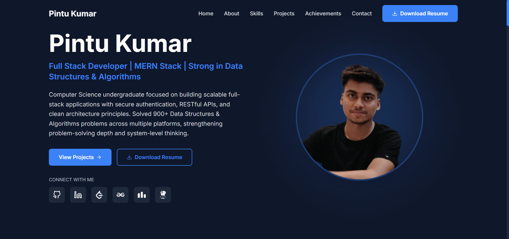

# 🚀 Pintu Kumar – Developer Portfolio



🔗 **Live Website:**  
👉 https://pintu-portfolio-xi.vercel.app/

---

## 👨‍💻 About

This is my personal developer portfolio built to showcase my projects, technical skills, and problem-solving experience.

I specialize in building scalable full-stack applications using the **MERN stack**, with a strong foundation in **Data Structures & Algorithms**.

---

## 🛠 Tech Stack

- ⚛️ React (Vite)
- 🎨 Tailwind CSS
- 🎬 Framer Motion
- 🧠 Component-Based Architecture
- 📱 Fully Responsive Design
- 🚀 Deployed on Vercel

---

## ✨ Features

- Modern dark-themed UI  
- Smooth animations and transitions  
- Project showcase with GitHub links  
- Resume download functionality  
- Clean and modular code structure  
- Optimized production build  

---

## 📁 Project Structure

```bash
portfolio/
├── assets/              # README preview image
├── public/
├── src/
│   ├── components/
│   ├── assets/
│   ├── App.jsx
│   └── main.jsx
├── index.html
├── package.json
├── vite.config.js
└── tailwind.config.js
```

## 🚀 Deployment

This portfolio is deployed on **Vercel** and automatically redeploys on every push to the `main` branch.

---

## 📫 Connect With Me

- GitHub: https://github.com/intensity4143  
- LinkedIn: https://linkedin.com/in/intensity4143  
- LeetCode: https://leetcode.com/Pintu_sharma  

---

## 📌 Future Enhancements

- Backend integration for contact form
- Additional project case studies
- Performance and SEO improvements
